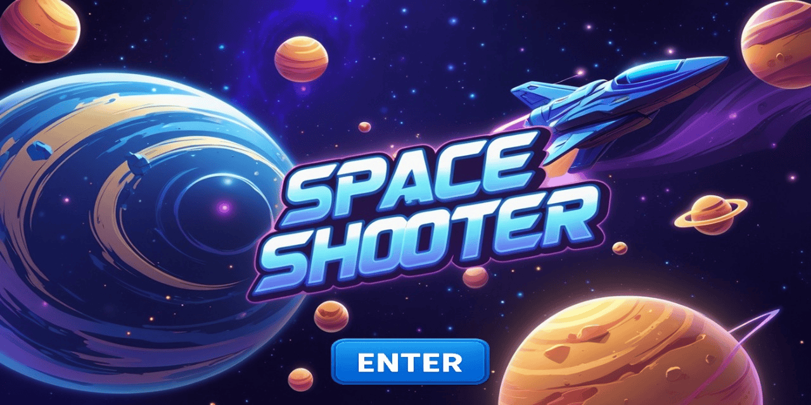

# 🚀 SPACE SHOOTER – 2D C++ Game Project 🎮

Welcome to **Space Shooter**, a 2D arcade-style shooting game built using **Modern iGraphics** and **iSound** in C++. Developed as part of a BUET CSE project, this game blends classic shooter gameplay with C++ programming concepts like object management, animations, and music handling.

---

## 🎯 Features

- 🔫 **Auto-Firing Spaceship**  
  The player ship fires bullets continuously with animated sprites.

- 👾 **Enemy Ships with AI**  
  Enemies spawn from random positions and fire back using tracking bullets.

- 🪨 **Stone Obstacles**  
  Bouncing stone obstacles spawn randomly and interfere with gameplay.

- 💥 **Missile System with AoE Damage**  
  Player can fire guided missiles that destroy multiple enemies in range.

- 🔄 **Arena Transitions**  
  Dynamic stage changes after achieving milestones (e.g., score ≥ 150).

- 🎶 **Background Music & Effects**  
  Arena-based theme music using `iSound`, synced with transitions and actions.

- ❤️ **Health System**  
  Custom health bars with item-based healing.

- 🖼️ **Animated Sprites & Graphics**  
  Custom visuals for ship, bullets, missiles, enemies, and effects.

---

## 🛠️ Technologies Used

- Language: **C++**
- Graphics: **Modern iGraphics**
- Sound: **iSound**
- IDE: Code::Blocks / VS Code

---

## 📸 Screenshots

> *(Here are some Images)*  
> 

---

## ▶️ Demo Video

> Watch the gameplay here:  
[](https://youtu.be/XoyaHeMMCFo)


---

## 🔧 How to Run

1. Clone this repository:
   ```bash
   git clone https://github.com/DIGANTA100/SPACE-SHOOTER
